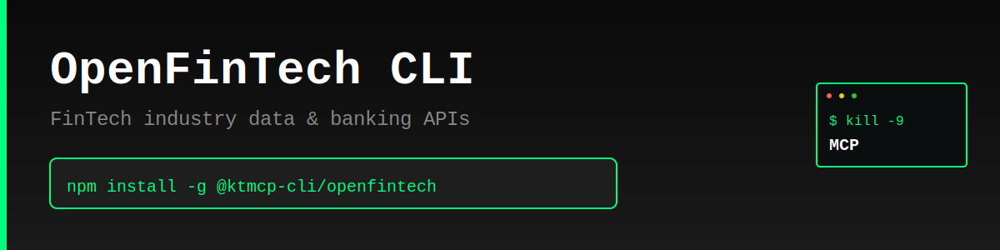

> "Six months ago, everyone was talking about MCPs. And I was like, screw MCPs. Every MCP would be better as a CLI."
>
> — [Peter Steinberger](https://twitter.com/steipete), Founder of OpenClaw
> [Watch on YouTube (~2:39:00)](https://www.youtube.com/@lexfridman) | [Lex Fridman Podcast #491](https://lexfridman.com/peter-steinberger/)

# OpenFinTech CLI

Production-ready command-line interface for OpenFinTech.io - the open database for standardized FinTech industry data including banks, currencies, payment methods, and more.

> **⚠️ Unofficial CLI** - This tool is not officially sponsored by OpenFinTech.io. Use at your own risk. Always test in development before production use.

## Features

- 🏦 **Banks** - Browse and search global banking institutions
- 💰 **Currencies** - Access standardized currency data (fiat & crypto)
- 🌍 **Countries** - Query country information and geolocation data
- 💳 **Payment Methods** - Explore payment and deposit methods
- 🏢 **Organizations** - Access FinTech organization data
- 📊 **JSON Output** - Machine-readable output for automation
- ⚡ **Fast** - Lightweight, no bloat, just works

## Why CLI > MCP

- ✅ Works instantly - no server setup required
- ✅ Direct API access - no middleware overhead
- ✅ Composable with standard Unix tools (grep, jq, etc.)
- ✅ Perfect for automation and scripting
- ✅ Lower latency, simpler architecture

## Installation

```bash
npm install -g @ktmcp-cli/openfintech
```

## Quick Start

```bash
# List currencies
openfintech currencies list

# Get currency details
openfintech currencies get USD

# Search banks
openfintech banks list --search "Wells Fargo"

# List countries
openfintech countries list

# Get payment methods
openfintech payment-methods list

# JSON output for scripting
openfintech currencies list --json | jq '.data[0]'
```

## Commands

### Configuration

```bash
# Show current config
openfintech config show

# Set custom API base URL (optional)
openfintech config set --base-url https://api.openfintech.io/v1
```

### Banks

```bash
# List banks
openfintech banks list

# Search banks
openfintech banks list --search "Chase"

# Get bank details
openfintech banks get WELLS_FARGO
```

### Currencies

```bash
# List all currencies
openfintech currencies list

# Search currencies
openfintech currencies list --search "Dollar"

# Get currency details
openfintech currencies get USD
openfintech currencies get BTC
```

### Countries

```bash
# List countries
openfintech countries list

# Search countries
openfintech countries list --search "United"

# Get country details
openfintech countries get US
```

### Payment Methods

```bash
# List payment methods
openfintech payment-methods list

# Get payment method details
openfintech payment-methods get visa
```

### Organizations

```bash
# List organizations
openfintech organizations list

# Get organization details
openfintech organizations get stripe
```

## JSON Output

All commands support `--json` flag for machine-readable output:

```bash
openfintech currencies list --json
openfintech banks get CHASE --json
```

## Use Cases

- **FinTech Development** - Query standardized banking and payment data
- **Currency Reference** - Get real-time currency codes and symbols
- **Payment Integration** - Research payment methods and providers
- **Geolocation Data** - Access country and region information
- **Automation** - Integrate FinTech data into scripts and pipelines

## API Reference

OpenFinTech.io is an open database providing standardized data for the FinTech industry. The API is free and does not require authentication.

- **API Docs**: https://openfintech.io/api/
- **Website**: https://openfintech.io

## License

MIT © KTMCP

---

**KTMCP** - Kill The MCP. Because CLIs are better.
